# ФГОБУ ВПО ПГУТИ кафедра ТОРС

# Визуальное моделирование в Scilab: Xcos (краткое руководство для начала работы)

Составитель: к.т.н. Чингаева А. М. Редактор: д.т.н., проф. Николаев Б. И.

Данное руководство предназначено для быстрого освоения Xcos — инструмен- та визуального моделирования Scilab. В руководстве описаны основные принци- пы построения диаграммы Xcos и на конкретных примерах рассмотрена работа базовых блоков, необходимых для моделирования систем радиосвязи. Основные сведения об изученных блоках сведены в справку в конце руководства.

# 1 Начало работы

# 1.1 Простейшая диаграмма

Для построения блочной диаграммы используется графический редактор Xcos: Главное меню Инструменты Визуальное моделирование Xcos.

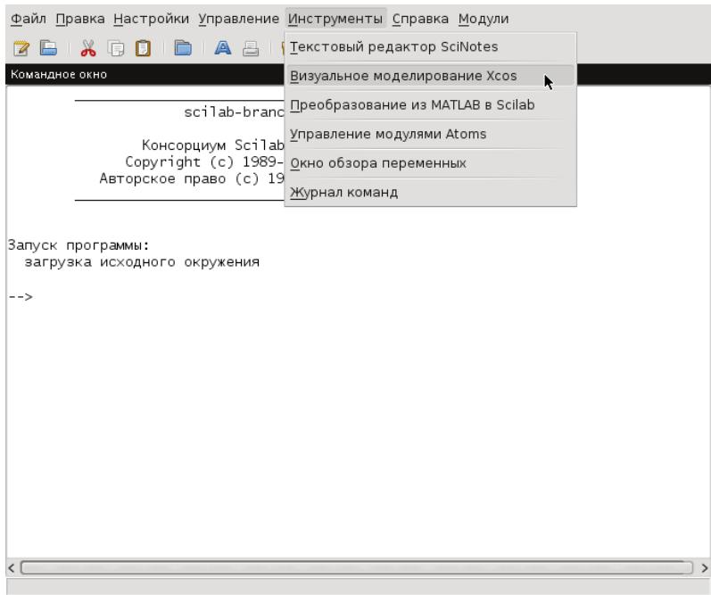  
Рис. 1. Командное окно Scilab

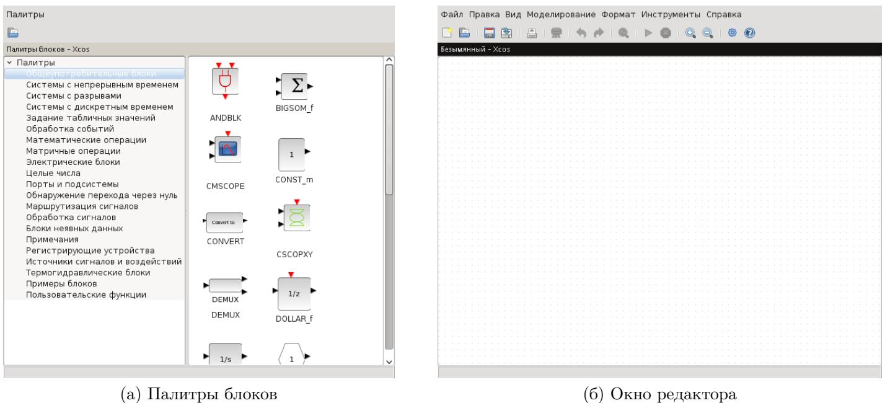  
Рис. 2. Графический редактор Xcos

После запуска Xcos обычно отображаются два окна: окно Палитры блоков и окно графического редактора. Если окно Палитры блоков отсутствует, его необ- ходимо отобразить, выбрав Вид $\longrightarrow$ Палитры блоков в главном меню окна графи- ческого редактора Xcos.

В окне Палитры блоков представлены группы блоков, из которых строится диаграмма Xcos. Выделив нужную группу левым кликом мыши (ЛКМ), вы увиди- те графические изображения входящих в неё блоков. Правый клик мыши (ПКМ) на изображении блока вызывает контекстное меню, через которое можно добавить выбранный блок к диаграмме или вызвать справку по данному блоку. Добавить выбранный блок к диаграмме можно также просто перетащив его мышью.

Выберите палитру Источники сигналов и воздействий и перетащите в ок- но диаграммы блоки GENSIN_f $\textcircled { \scriptsize { 1 } } N _ { \downarrow } .$ (генератор синусоиды) и SampleCLK (счётчик времени). Затем перейдите к палитре Регистрирующие устройства и до- бавьте к диаграмме блок CSCOPE (осциллограф). Соедините выход генера- тора с чёрным входом осциллографа, а выход счётчика с красным входом ос- циллографа. Счётчик используется для периодической активации осциллографа с заданным временным интервалом.

Соединительные линии проводятся от выхода к входу (или наоборот) при за- жатой ЛКМ. Разрешённые соединения подсвечиваются зелёным. Для удаления соединительной линии выделите её и нажмите Delete.

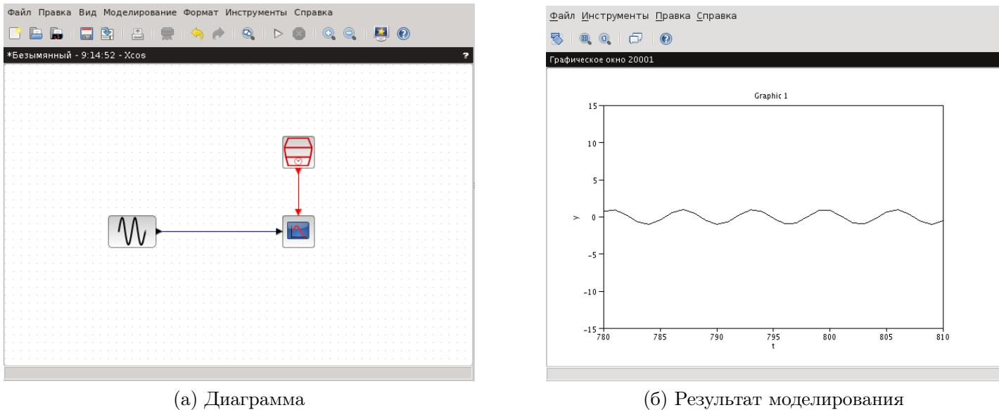  
Рис. 3. Простейшая диаграмма

Для запуска моделирования выберите Моделирование Выполнить в глав- ном меню редактора или просто нажмите на соответствующую кнопку в па- нели инструментов. Для остановки моделирования выберите Моделирование Завершить или же воспользуйтесь соответствующей кнопкой в панели инстру- ментов.

# 1.2 Сохранение и загрузка

Сохраните текущую диаграмму, выбрав Файл Сохранить в главном меню окна графического редактора. Сохраняйтесь чаще! Используйте «горячие» клавиши Ctrl + S для экономии времени. Всегда сохраняйте диаграммы толь- ко в своей папке!

Загрузить сохранённую диаграмму можно через Файл Открыть или Файл Последние файлы.

# 1.3 Основные понятия

Любая диаграмма Xcos содержит два типа соединений: регулярные (чёрные) и управляющие (красные). По регулярным соединениям передаются сигналы дан- ных, а по управляющим — сигналы активации. Блоки также могут иметь регуляр- ные и управляющие входы и выходы. Как правило регулярные входы и выходы блоков располагаются слева и справа от изображения блока, а управляющие сверху и снизу.

В качестве основного источника сигналов активации мы будем использовать счётчик времени SampleCLK. Его особенность заключается в том, что все такие счётчики внутри одной диаграммы синхронизированы.

Если блок имеет управляющий вход, то он «срабатывает» каждый раз, когда на него поступает сигнал активации. Поведение блока, не имеющего управляю- щего входа, определяется его внутренними параметрами.

Блок может наследовать сигнал активации от предыдущего блока, т.е. сраба- тывать при поступлении на его регулярный вход сигнала данных. Также, блок может быть активным всегда (например, генератор гармонического сигнала).

Блок без входов, не получающий сигналов активации и не объявленный ак- тивным всегда, является константным блоком. Выход такого блока не зависит от времени, а сам блок «срабатывает» лишь единожды, на этапе инициализации.

После «срабатывания» блока значения на его выходе остаются неизменными до следующего момента активации.

Таким образом, выходные значения константных блоков не изменяются нико- гда, как бы часто вы к ним ни обращались. Выходные значения блоков, активных всегда, будут меняться так часто, как часто вы будете их запрашивать. В осталь- ных случаях выходные значения будут меняться так часто, как часто блок будет получать сигнал активации: от входа активации или наследовать от предыдущего блока.

# 1.4 Изменение параметров блока

Двойной ЛКМ (или ПКМ и выбор в контекстном меню пункта Параметры блока) на блоке в окне графического редактора вызывает окно Ввод значений.

Это окно позволяет менять параметры блока (если блок допускает изменение параметров).

Вызовите окно Ввод значений для осциллографа на вашей диаграмме. Поме- няйте значения переменных Ymin и Ymax, установив их равными -2 и 2 соответ- ственно. Запустите моделирование.

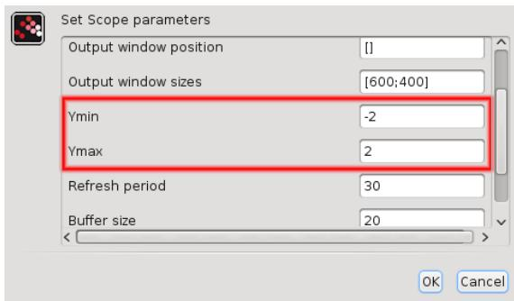  
Рис. 4. Окно изменения параметров блока

Остановите моделирование и обратите внимание на график сигнала. Синусо- ида на нём выглядит «рваной». Чтобы сделать её более гладкой, надо уменьшить интевал взятия отсчётов. Для этого обратитесь к счётчику времени и измените параметр Sample time (интервал дискретизации), сделав его равным 0.1. Запу- стите моделирование.

Значение параметра может быть любой инструкцией, понятной Scilab. Вызо- вите окно изменения параметров генератора синусоиды и установите значение параметра Frequency (rad/s) (частота, рад/с) равным $2 { \ast } \% \mathrm { p i } / 5$ .

# 1.5 Время моделирования

Выберите палитру Обработка событий и добавьте к диаграмме блок ENDBLK . Установите параметр блока Final simulation time (конечное время моделирования) равным 30. Запустите моделирование.

Другой способ задания конечного времени моделирования — выбрать пункт Моделирование Установка в главном меню графического редактора и устано- вить параметр Конечное время интегрирования равным нужному значению.

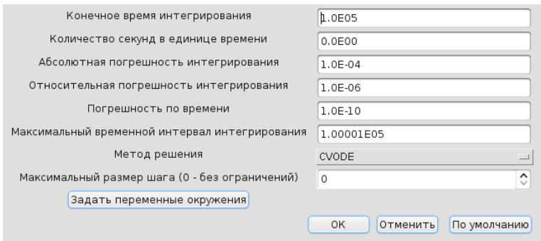  
Рис. 5. Окно изменения параметров моделирования

При наличии блока ENDBLK система выберет в качестве конечного наименьшее значение из Final simulation time и Конечное время интегрирования.

# 1.6 Переменные окружения

Выберите пункт Моделирование Установить контекст в главном меню ре- дактора. Задайте следующие переменные:

stime $\scriptstyle { \mathfrak { = } } 0$ .1 omega0 $=$ 2\*%pi/5 endtime $\scriptstyle = 3 0$

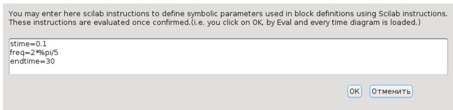  
Рис. 6. Окно задания переменных окружения

Установите частоту генератора равной omega0, интервал дискретизации рав- ным stime и конечное время моделирования равным endtime.

Переменные окружения должны быть заданы перед их использованием. Зна- чения переменных могут быть любой инструкцией, понятной Scilab.

# 2 Использование основных блоков Xcos

# 2.1 Осциллографы

Для графического отображения сигнала как функции времени в Xcos ис- пользуются блоки CSCOPE и CMSCOPE из палитры Регистрирующие устройства.

Блок CSCOPE имеет один вход и отображает один или множество сигналов в единой системе координат. Скаляр (число) на входе осциллографа CSCOPE отобра- жается как единственный сигнал (см. рис. 3), вектор — как множество сигналов.

Сохраните вашу диаграмму под другим именем: Файл Сохранить как. До- бавьте к диаграмме, состоящей из генератора, осциллографа и счётчика време- ни, блок INTEGRAL_f 1/ (интегратор) из палитры Системы с непрерывным временем и блок MUX MUX (мультиплексор) из палитры Маршрутизация сигналов. Подключите выход генератора к первому входу мультиплексора и ко входу ин- тегратора, выход интегратора — ко второму входу мультиплексора и, наконец, выход мультиплексора ко входу осциллографа.

Входы блоков можно подключать к уже существующим соединительным ли- ниям. Разрешённые соединения подсвечиваются зелёным.

Соединительные линии могут иметь любую конфигурацию. В процессе созда- ния соединения нажатие ЛКМ добавляет новый узел. Создать новый узел для изменения вида уже существующего соединения можно двойным ЛКМ по соеди- нительной линии.

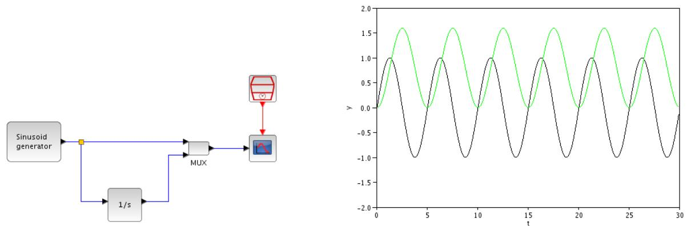  
Рис. 7. Использование CSCOPE

Мультиплексор в данном примере объединяет два скаляра на своих входах в один вектор из двух элементов. Осциллограф рассматривает элементы вектора как точки отдельных сигналов и изображает их соответственно.

Блок CMSCOPE имеет два и более входов и отображает сигналы в отдельных системах координат в едином графическом окне.

Добавьте к диаграмме блок CMSCOPE и блок ABS_VALUE ABS (модуль) из палитры Математические операции. Подключите к первому входу осциллогра- фа выход генератора, а ко второму — выход блока ABS_VALUE. На вход блока ABS_VALUE подайте сигнал с генератора. Управляющий вход осциллографа соеди- ните с выходом счётчика времени.

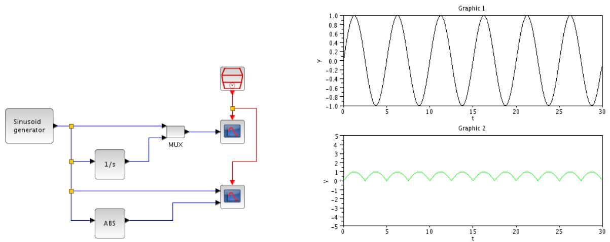  
Рис. 8. Использование CMSCOPE

Пределы по оси y задаются в параметрах блока переменными Ymin vector и

Ymax vector. Первый элемент вектора относится к первому графику, второй ко второму. Задайте пределы $( - 2 , 2 )$ для первого графика и $( 0 , 2 )$ для второго.

Интервал обновления осциллографа (размер отображаемого промежутка оси времени t) задаётся в параметрах блока переменной Refresh period (интервал обновления). Для блока CSCOPE это скаляр, для CMSCOPE — вектор, первый элемент которого относится к первому графику, второй — ко второму.

Блок CMSCOPE, аналогично CSCOPE, отображает векторный вход в виде множе- ства сигналов в одной системе координат. Однако, в отличие от CSCOPE, для него требуется явно указать размерности каждого из входов. Размерности входов за- даются в параметрах блока переменной Input port sizes (размерности входных портов) — вектор, первый элемент которого относится к первому графику, второй — ко второму.

Задайте размерность первого входа равной 2. Подключите к первому входу осциллографа сигнал с выхода мультиплексора. Запустите моделирование.

Переменная Input port sizes имеет ещё одно важное значение: её размер- ность определяет количество входов осциллографа. Изменение размерности Input port sizes влечёт за собой соответствующее изменение размерности переменных Ymin vector, Ymax vector и Refresh period.

Добавьте третий элемент к Input port sizes, равный 1. Установите для но- вого графика пределы по оси y и интервал обновления. Подключите к третьему входу осциллографа сигнал с выхода генератора.

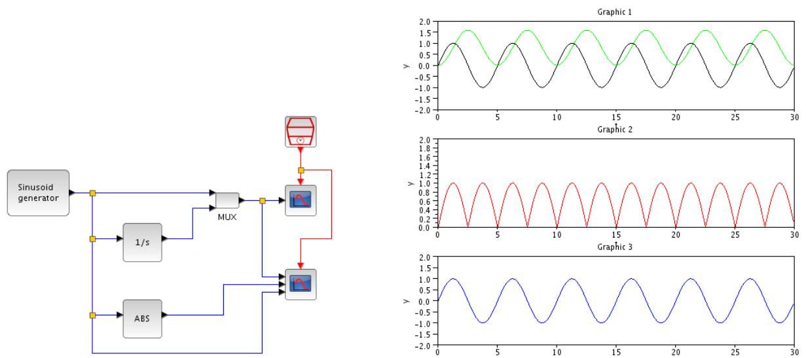  
Рис. 9. Расширенное использование CMSCOPE

Цвет графиков функций задаётся в параметрах блока переменной Drawing colors — вектор, элементы которого соответствуют номеру цвета в стандартной палитре. Первый элемент определяет цвет первой кривой, второй — цвет второй кривой и т.д. Если указать значение цвета со знаком минус, то вместо кривых на графике будут отображаться метки.

# 2.2 Источники сигналов

Источники сигналов находятся в палитре Источники сигналов и воздействий. Нам понадобятся

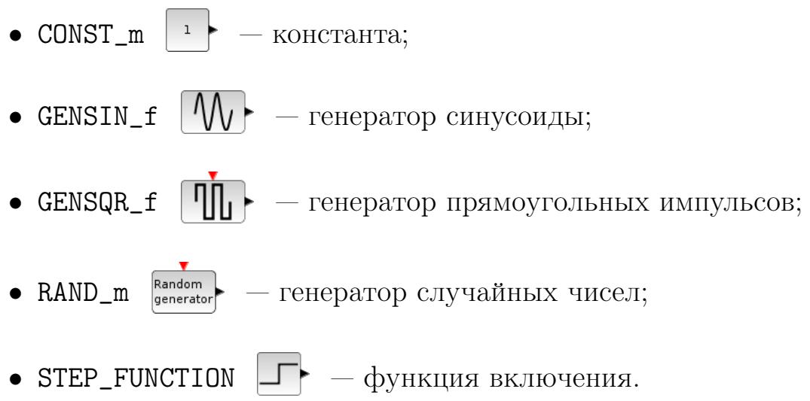

# 2.2.1 Константа

Блок CONST_m используется для формирования постоянной величины. Он имеет один параметр: Constant Value — значение константы. Блок является констатным блоком (см. раздел 1.3 на стр. 5).

# 2.2.2 Генератор синусоиды

Блок GENSIN_f $\textcircled { \scriptsize { 1 } } N _ { \downarrow } .$ используется для получения сигналов синусоидальной формы. Он является активным всегда (см. раздел 1.3 на стр. 5). Параметры блока:

• Magnitude — амплитуда;   
• Frequency (rad/s) — частота (рад/с);   
• Phase (rad) — фаза (рад).

Создайте новую диаграмму (Файл → Новая диаграмма). Добавьте к ней два генератора синусоиды. Установите фазу первого генератора равной %pi/2 (коси- нус), а второго оставьте равной нулю (синус). Отобразите сигналы с обоих гене- раторов в одном окне осциллографа.

# 2.2.3 Генератор прямоугольных импульсов

Блок GENSQR_f используется для получения последовательности пря- моугольных импульсов (видеоимпульсов) со скважностью 2 — т.е. для формиро- вания меандра. Блок имеет один управляющий вход и один регулярный выход.

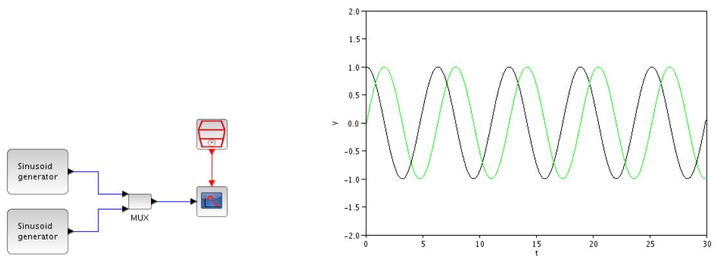  
Рис. 10. Использование GENSIN_f

Параметр Amplitude задаёт амплитуду импульсов. Длительность импульсов опре- деляется интервалом поступления на управляющий вход сигналов активации.

Создайте новую диаграмму. Добавьте к диаграмме генератор прямоугольных импульсов и счётчик времени. Установите интервал дискретизации равным 5. Со- едините управляющий выход счётчика с управляющим входом генератора. Отоб- разите сигнал генератора на экране осциллографа.

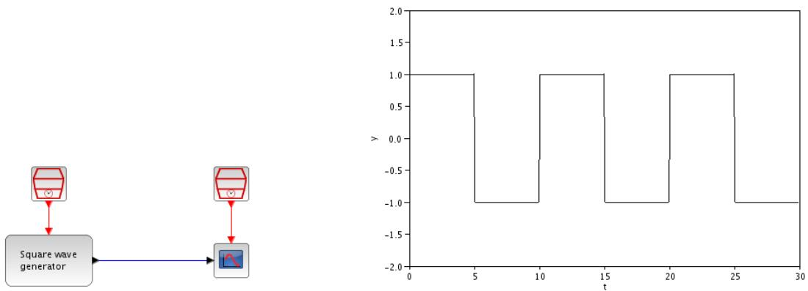  
Рис. 11. Использование GENSQR_f

# 2.2.4 Генератор случайных чисел

Блок RAND_m Random используется для получения случайных чисел, распреде- лённых по нормальному или равномерному закону. Блок имеет один управляю- щий вход и один регулярный выход. Параметры блока:

• Data type (тип выходных данных): 1 — действительные числа, 2 — ком- плексные;   
• flag — флаг, определяющий вид закона распределения: 0 — равномерное, 1 нормальное (гауссовское);

• A и B — для равномерного распределения величина A определяет минималь- ное значение, а величина A + B — максимальное. Для нормального распре- деления A определяет матожидание, а B — среднеквадратическое отклонение (СКО). • SEED — числа, используемые для инициализации машинного генератора псевдослучайных чисел. Первое значение относится к действительной, а вто- рое — к мнимой части выходного сигнала. Два генератора с одинаковым па- раметром SEED будут выдавать два идентичных псевдослучайных сигнала.

Создайте диаграмму и добавьте к ней генератор случайных чисел. Установите параметры генератора таким образом, чтобы получить на выходе случайные чис- ла, распределённые по нормальному закону с мат. ожиданием равным 0 и СКО равным 1. Выведите сигнал генератора в окно осциллографа с интервалом дис- кретизации 0.1.

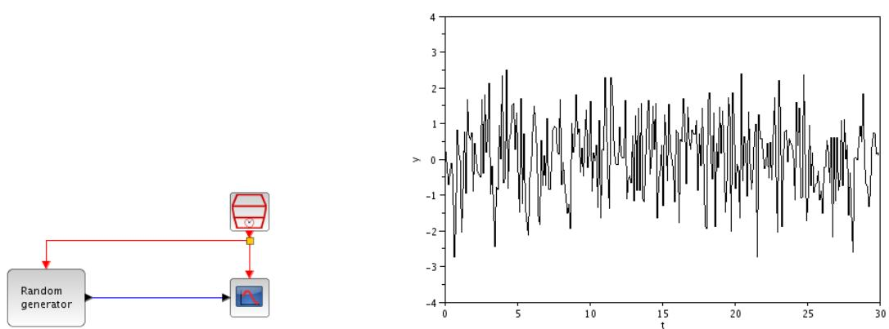  
Рис. 12. Белый шум

Случайный процесс на выходе генератора (рис. 12) представляет собой белый гауссовский шум (его отсчёты некоррелированы).

С помощью блока RAND_m можно получить случайный синхронный телеграф- ный сигнал (СТС), имитирующий передаваемое двоичное сообщение.

Установите параметры генератора таким образом, чтобы получить числа, рав- номерно распределённые в диапазоне $( - 1 , 1 )$ . Добавьте к выходу генератора блок SIGNUM из палитры Математические операции. На управляющий вход гене- ратора подайте сигнал от счётчика времени с интервалом 2. Отобразите выходной сигнал блока SIGNUM на экране осциллографа с интервалом дискретизации 0.1.

Блок SIGNUM реализует знаковую функцию:

$$
\mathrm { s i g n } ( x ) = \left\{ \begin{array} { r l } { - 1 , } & { { } x < 0 ; } \\ { 0 , } & { { } x = 0 ; } \\ { 1 , } & { { } x > 0 . } \end{array} \right.
$$

Таким образом, все числа в диапазоне $( - 1 , 0 )$ с выхода генератора будут пре- образованы в $- 1$ , а числа в диапазоне $( 0 , 1 ) \mathrm { ~ - ~ s ~ } { + } 1$ . Ноль на выходе генератора

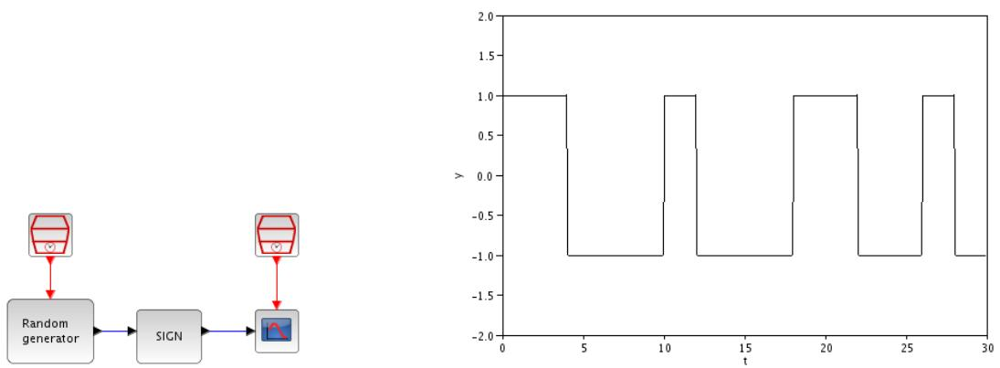  
Рис. 13. Случайный синхронный телеграфный сигнал

преобразуется в 0, что нежелательно. Однако, вероятность этого события настоль- ко мала, что им можно пренебречь. Вероятности $- 1 \mathrm { ~  ~ u ~ } + 1 \mathrm { ~  ~ I ~ }$ в СТС будут равны, т.к. интервалы $( - 1 , 0 )$ и $( 0 , 1 )$ имеют одинаковую длину.

# 2.2.5 Функция включения

Блок STEP_FUNCTION генерирует функцию включения. Параметры бло- ка:

• Step time — время включения;   
• Initial value — начальное значение;   
• Final value — конечное значение.

Создайте диаграмму, содержащую генератор функции включения с парамет- рами: время включения — 10, начальное значение — 0, конечное значение — 1. Отобразите сигнал с выхода генератора в окне осциллографа.

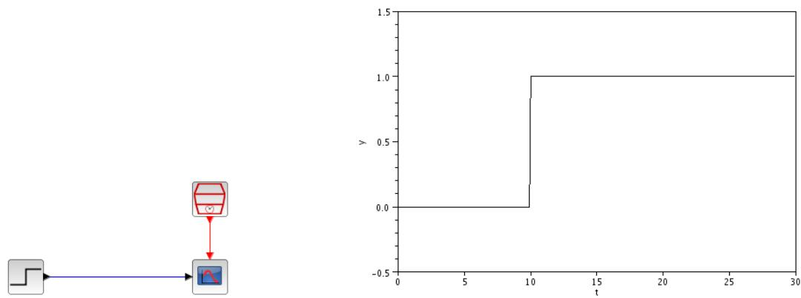  
Рис. 14. Функция включения

Используя пару генераторов функции включения и блок BIGSOM_f ∑ (сум- матор) из палитры Математические операции можно получить одиночный пря- моугольный импульс.

Добавьте к диаграмме ещё один блок STEP_FUNCTION и блок BIGSOM_f. Устано- вите время включения второго генератора равным 15 и конечное значение равным $- 1$ . Соедините выходы генераторов со входами сумматора, а выход сумматора — со входом осциллографа.

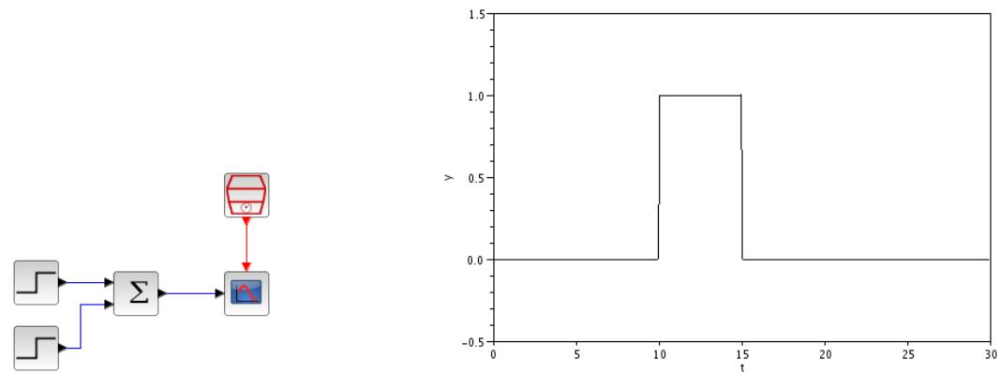  
Рис. 15. Одиночный прямоугольный импульс

Блок BIGSOM_f ∑ (сумматор) имеет один параметр: Input ports signs/gain — вектор весовых коэффициентов входных портов. Размерность этого вектора определяет число портов. Выходной сигнал сумматора равен взве- шенной сумме входных сигналов. По-умолчанию блок имеет два входа с весами 1, т.е. просто суммирует входные сигналы.

Длительность полученного импульса определяется разностью времени вклю- чения генераторов. Уменьшая эту разность до сколь угодно малого значения, будем получать сигнал, приближающийся к дельта-функции. Практически ми- нимальная разность определяется наименьшим временем дискретизации из всех счётчиков на диаграмме.

# 2.3 Маршрутизация сигналов

Из палитры Маршрутизация сигналов нам понадобятся три основных блока:

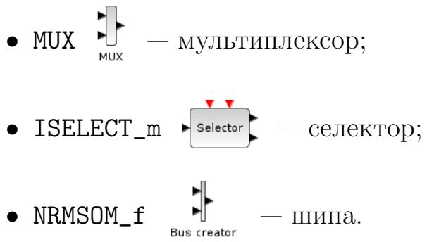

# 2.3.1 Мультиплексор

Пример использвания этого блока приведён в разделе 2.1 на стр. 7. Мульти- плексор объединяет входные скаляры в один выходной вектор. Количество вхо-

дов (оно же — размер выходного вектора) задаётся переменной Number of input ports в параметрах блока.

# 2.3.2 Селектор

Блок ISELECT_m Selector используется для разбиения входного потока на несколько выходных. Количество управляющих входов равно количеству регу- лярных выходов. Каждый управляющий вход соответствует одному выходу: при поступлении на первый управляющий вход сигнала активации входной поток направляется на первый выход, при поступлении сигнала активации на второй управляющий вход — на второй выход и т.д. Параметры блока:

• Data type — тип данных: 1 — действительные, 2 — комплексные и т.д. (со- ответствуют стандартным типам данных Scilab);   
• number of outputs — количество выходов;   
• initial connected output — номер изначально подключенного выхода.

Пусть имеется СТС с тактовым интервалом, равным 1. Необходимо разбить сигнал от источника на два потока, первый из которых содержит посылки с чёт- ными, а второй — с нечётными номерами.

Создайте новую диаграмму. Соберите схему источника СТС (см. раздел 2.2.4 на стр. 11). Добавьте к диаграмме селектор и два счётчика времени. Соедини- те счётчики с управляющими входами селектора. Установите параметр initial connected output селектора равным 2. Задайте интервалы дискретизации счёт- чиков на входах селектора равными 2 и установите задержку (offset) счётчика на первом входе селектора равной 1. Добавьте к схеме осциллограф CMSCOPE. Вы- ведите в окна осциллографа сигнал с выхода генератора СТС и сигналы с выходов селектора.

Условие разбиения сигнала реализовано правильной установкой параметров счётчиков времени на управляющих входах селектора. Счётчик на втором входе срабатывает сразу и продолжает выдавать сигналы активации с интервалом 2 (т.е. с интервалом, вдвое превышающим тактовый интервал СТС). Счётчик на первом входе срабатывает с задержкой 1 (один тактовый интервал) и, как и счётчик на втором входе, выдаёт сигналы активации с интервалом 2. Таким образом, первая, третья и т.д. (т.е. нечётные) посылки будут перенаправлены на выход 2, а вторая, четвёртая и т.д. (т.е. чётные) посылки — на выход 1.

# 2.3.3 Шина

Блок NRMSOM_f объединяет множество входных потоков в один выход- ной. Число входных потоков задаётся переменной number of inputs в парамет- рах блока.

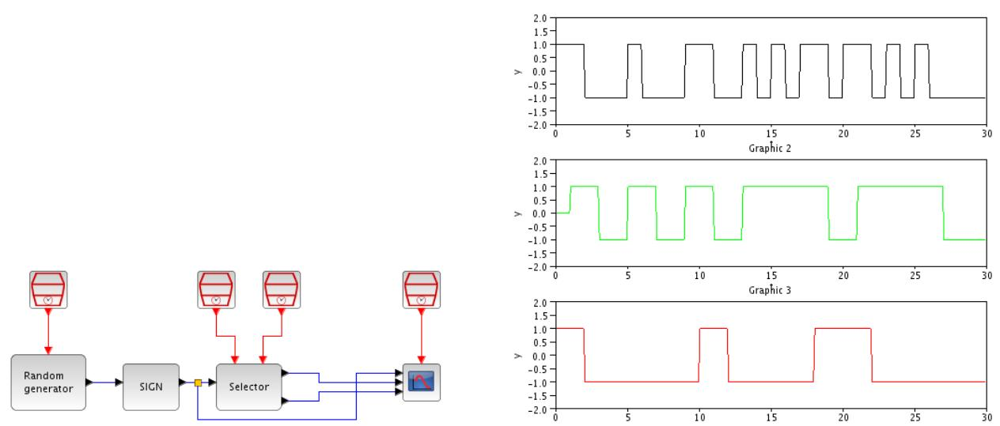  
Рис. 16. Использование селектора

Объедините потоки чётных и нечётных посылок из предыдущего примера в один. Добавьте к диаграмме блок NRMSOM_f. Подайте на первый вход блока сигнал с первого выхода селектора, на второй — сигнал со второго выхода селектора. До- бавьте к диаграмме осциллограф CMSCOPE. Выведите в окна осциллографа сигнал с выхода генератора СТС и сигнал с выхода шины.

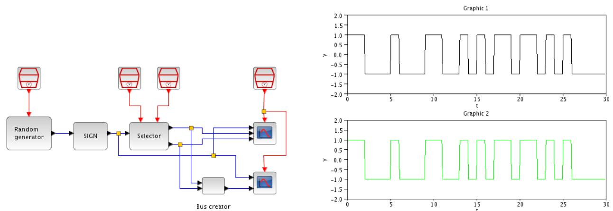  
Рис. 17. Использование шины

При обновлении значения сигнала на любом из входов шины оно перенаправ- ляется на выход.

# 2.4 Блок задержки

Continuous Блок TIME_DELAY fix delay из палитры Системы с непрерывным временем ре-   
ализует задержку входного сигнала во времени. Величина задержки определяется   
переменной Delay в параметрах блока. Переменная initial input задаёт началь-   
ное значение выходного сигнала, а переменная Buffer size — рзамер внутрен-   
него буфера блока, в котором хранятся отсчёты задержанного входного сигнала.

Размер буфера должен быть не меньше чем число отсчётов сигнала за время задержки.

Создайте новую диаграмму. Добавьте к диаграмме генератор синусоиды и блок задержки. Установите время задержки равным 5. Отобразите сигнал с гене- ратора и задержанный сигнал в одном окне осциллографа.

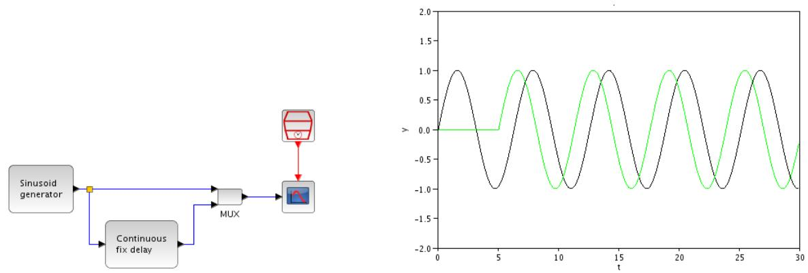  
Рис. 18. Использование блока задержки

# 3 Краткая справка

# 3.1 Регистрирующие устройства

CSCOPE — осциллограф с одним входом.

Параметры блока:

• Color — цвет графиков. Вектор, элементы которого соответствуют номеру цвета в стандартной палитре. Если указать значение цвета со знаком минус, то вместо кривых на графике будут отображаться метки. • Ymin и Ymax — минимальное и максимальное значение по оси y. • Refresh period — интервал обновления осциллографа (размер отображае- мого промежутка оси времени t).

CMSCOPE — осциллограф со многими входами.

Параметры блока:

• Input port sizes — размерности входных портов. Вектор, число элемен- тов которого равняется числу входов осциллографа, а значения элементов задают размерности каждого из входов. • Drawing colors — цвет графиков. Вектор, элементы которого соответству- ют номеру цвета в стандартной палитре. Если указать значение цвета со знаком минус, то вместо кривых на графике будут отображаться метки.

• Ymin vector и Ymax vector — минимальное и максимальное значение по оси y для каждого входа в отдельности. • Refresh period — интервал обновления осциллографа (размер отображае- мого промежутка оси времени t) для каждого входа в отдельности.

# 3.2 Источники сигналов и воздействий

SampleCLK — счётчик времени.

Параметры блока:

• Sample time — интервал дискретизации.   
• offset — смещение (задержка включения счётчика).

1 CONST_m — константа;

Параметры блока:

• Constant Value — значение константы.   
W GENSIN_f — генератор синусоиды;

Параметры блока:

• Magnitude — амплитуда.   
• Frequency (rad/s) — частота (рад/с).   
• Phase (rad) — фаза (рад).

GENSQR_f — генератор прямоугольных импульсов;

Параметры блока:

• Amplitude — амплитуда.

RAND_m — генератор случайных чисел;

Параметры блока:

• Data type (тип выходных данных): 1 — действительные числа, 2 — ком- плексные;   
• flag — флаг, определяющий вид закона распределения: 0 — равномерное, 1 — нормальное (гауссовское);   
• A и B — для равномерного распределения величина A определяет минималь- ное значение, а величина A $+$ B — максимальное. Для нормального распре- деления A определяет матожидание, а B — среднеквадратическое отклонение (СКО).

• SEED — числа, используемые для инициализации машинного генератора псевдослучайных чисел. Первое значение относится к действительной, а вто- рое — к мнимой части выходного сигнала. Два генератора с одинаковым па- раметром SEED будут выдавать два идентичных псевдослучайных сигнала.

STEP_FUNCTION — функция включения.

Параметры блока:

• Step time — время включения;   
• Initial value — начальное значение;   
• Final value — конечное значение.

# 3.3 Обработка событий

ENDBLK.

• Final simulation time — конечное время моделирования.

# 3.4 Cистемы с непрерывным временем

INTEGRAL_f — интегратор.

Параметры блока:

• Initial Condition — начальное значение.

fix delay Continuous

TIME_DELAY — задержка во времени.

Параметры блока:

• Delay — величина задержки.

• initial input — начальное значение выходного сигнала.

• Buffer size — размер внутреннего буфера блока, в котором хранятся отсчё- ты задержанного входного сигнала. Размер буфера должен быть не меньше чем число отсчётов сигнала за время задержки.

# 3.5 Математические операции

ABS_VALUE — модуль:

$$
y = | x | .
$$

SIGNUM — знаковая функция:

$$
\mathrm { s i g n } ( x ) = \left\{ \begin{array} { r l } { - 1 , } & { { } x < 0 ; } \\ { 0 , } & { { } x = 0 ; } \\ { 1 , } & { { } x > 0 . } \end{array} \right.
$$

BIGSOM_f — сумматор:

$$
y = \sum g _ { i } x _ { i }
$$

Параметры блока:

• Input ports signs/gain — вектор весовых коэффициентов ( $g _ { i }$ ) входных портов. Размерность этого вектора определяет число портов.

# 3.6 Маршрутизация сигналов

MUX MUX — мультиплексор. Объединяет данные на своих входах в один век- торный выход.

Параметры блока:

• number of input ports or vector of sizes — число входных портов (от 1 до 7).

ISELECT_m — селектор.

Параметры блока:

• Data type — тип данных: 1 — действительные, 2 — комплексные и т.д. (со- ответствуют стандартным типам данных Scilab);   
• number of outputs — количество выходов;   
• initial connected output — номер изначально подключенного выхода.

NRMSOM_f — шина. Объединяет множество входных потоков в один

выходной.

Параметры блока:

• number of inputs — число входов.

# 4 Литература

1. Scilab/Xcos help pages.

2. Stephen L. Campbell, Jean-Philippe Chancelier and Ramine Nikoukhah. Modeling and Simulation in Scilab/Scicos with ScicosLab 4.4, Second Edition.: Springer, 2010.